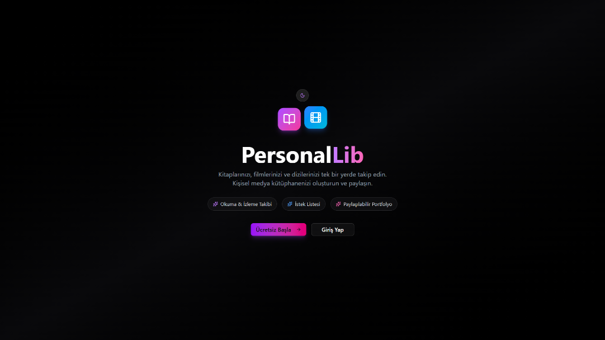
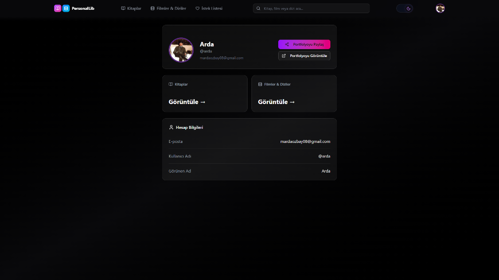
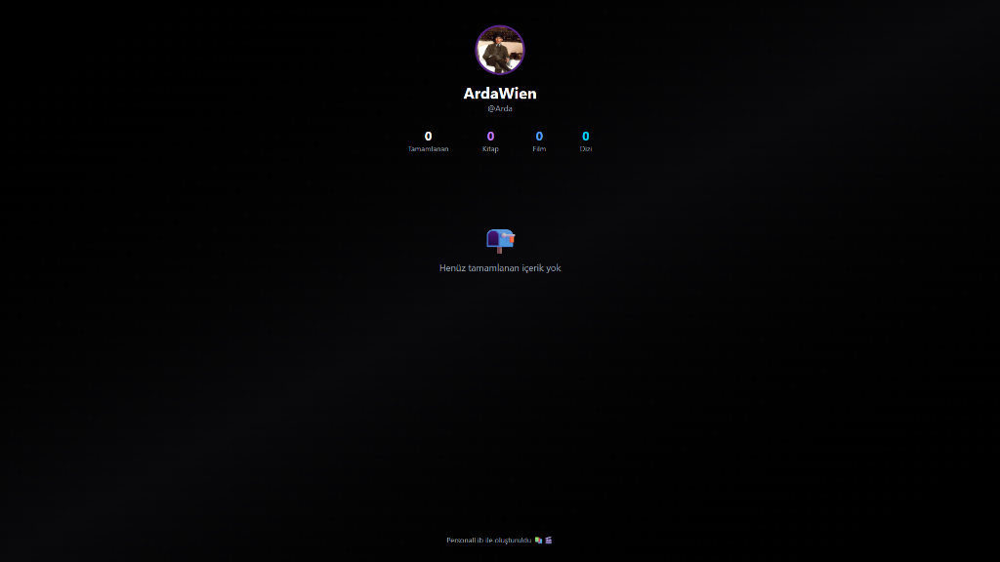
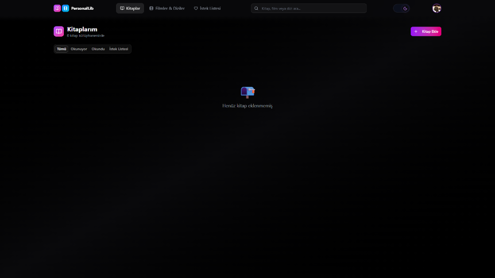
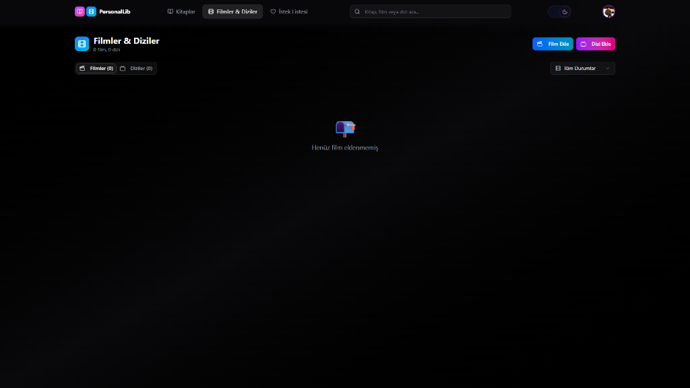

# 

**PersonalLib**, okuduğunuz kitapları, izlediğiniz filmleri ve dizileri takip etmenizi sağlayan; modern, güvenli ve kişiselleştirilebilir bir dijital kütüphane uygulamasıdır.

## 🚀 Özellikler

- **📂 Medya Takibi:** Kitap, Film ve Dizi koleksiyonlarınızı ayrı ayrı yönetin.
- **📊 Durum Yönetimi:** "Okunacak", "Okunuyor", "Tamamlandı" gibi durumlarla ilerlemenizi takip edin.
- **✨ Modern Arayüz:** Tailwind CSS ve shadcn/ui ile tasarlanmış, Responsive ve Karanlık Mod (Dark Mode) destekli şık tasarım.
- **🔒 Gelişmiş Güvenlik.**

## 📸 Ön İzleme

## 🛠️ Teknolojiler

- **Frontend:** [Next.js 15+](https://nextjs.org/), React 19, Tailwind CSS, Framer Motion
- **Backend:** Next.js API Routes (Serverless)
- **Database:** [Neon (PostgreSQL)](https://neon.tech/), Prisma ORM
- **Auth:** [Auth.js (NextAuth)](https://authjs.dev/)
- **Deploy:** [Vercel](https://vercel.com/)

## 🛡️ Lisans

Bu proje **Creative Commons Attribution-NonCommercial 4.0 International (CC BY-NC 4.0)** ile lisanslanmıştır.
- ✅ Kişisel ve eğitim amaçlı kullanabilir, değiştirebilir ve paylaşabilirsiniz.
- ❌ **Ticari amaçla KULLANILAMAZ.**
- ✍️ Paylaşırken atıf yapılması zorunludur.

Detaylar için [LICENSE](LICENSE) dosyasına bakınız.

---
Made with ❤️ by [ArdaWien](https://github.com/Ard4Wien)
