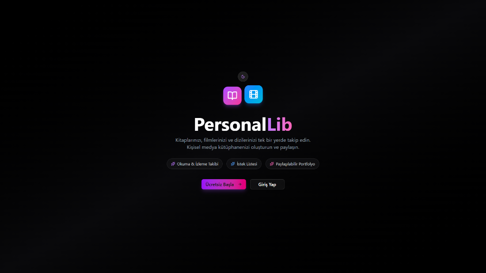
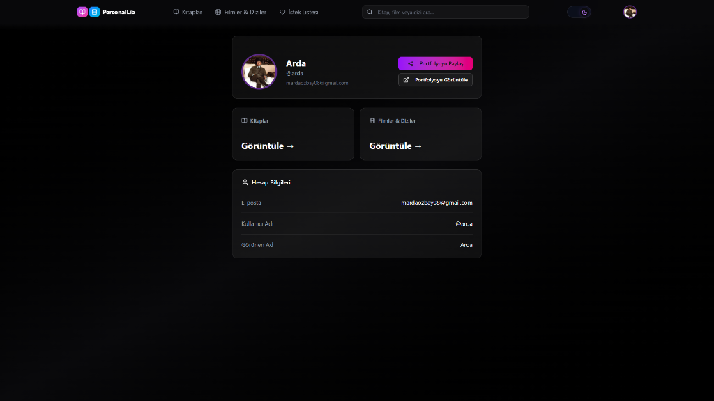
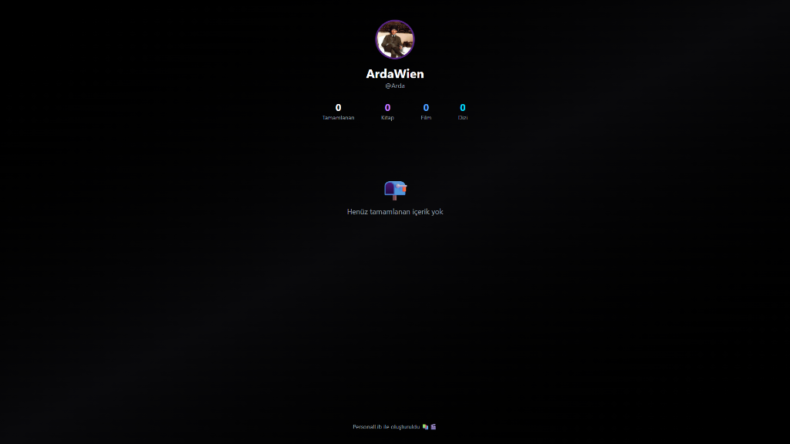

<p align="center">
  
</p>

<h1 align="center">PersonalLib</h1>

<p align="center">
  <a href="#english">English</a> • <a href="#turkish">Türkçe</a>
</p>

<p align="center">
  <sub>A comprehensive digital library and portfolio system for managing and sharing your collections.</sub>
</p>

<p align="center">
  
  
  
  
</p>

---

<a name="english"></a>
## English Version

PersonalLib is a minimalist and secure platform designed to consolidate your consumption of various media types into a single, unified interface. It serves as both a private tracking tool and a public portfolio to showcase your library to the world.

## Features

- **Multi-Media Tracking**: Dedicated sections for movies, TV series, books, manga, and anime.
- **Progress Management**: Track your current status with granular labels such as Reading, Watching, Completed, or Wishlist.
- **Advanced Validation**: Real-time SMTP email verification via Abstract API and debounced username availability checks.
- **Adaptive Interface**: Native support for dark and light modes with a consistent, premium design language.
- **Public Portfolios**: Generate shareable profiles to showcase your curated collections with privacy controls.
- **Security Hardening**: Implementation of Content Security Policy (CSP), JWT algorithm verification, and XSS prevention.

## Tech Stack

PersonalLib is built with a modern, type-safe stack for maximum performance and reliability:

- **Frontend**: Next.js 15 (App Router), React 19, Tailwind CSS, Framer Motion.
- **Backend**: Next.js API Routes (Serverless), Prisma ORM.
- **Database**: PostgreSQL hosted on Neon.
- **Authentication**: Auth.js (NextAuth) with secure session management.
- **Validation**: Zod schema validation and Abstract API integration.

## Screenshots

<p align="center">
  
  <br />
  
  <br />
  
</p>

## Project Structure

```text
src/
├── app/               # Next.js App Router (Pages and API Routes)
│   ├── api/           # Serverless backend endpoints
│   ├── (dashboard)/   # Authenticated user dashboard
│   └── portfolio/     # Public/Private user profiles
├── components/        # Reusable UI and layout components
│   ├── layout/        # Navigation, header, and wrappers
│   ├── media/         # Media-specific cards and grids
│   └── ui/            # Base Tailwind-styled components
├── lib/               # Utility functions, validators, and clients
├── context/           # React Context providers
└── types/             # Shared TypeScript interfaces and DTOs
```

## Getting Started

To set up a local development environment:

1. Clone the repository:
   ```bash
   git clone https://github.com/Ard4Wien/PersonalLib.git
   ```

2. Install dependencies:
   ```bash
   npm install
   ```

3. Configure environment variables in a `.env` file (Database URL, Auth secrets, API keys).

4. Initialize the database:
   ```bash
   npx prisma generate
   npx prisma db push
   ```

5. Start the development server:
   ```bash
   npm run dev
   ```

## Security

PersonalLib prioritizes data integrity and user safety:
- **Sanitization**: All user inputs are validated via Zod schemas to prevent injection.
- **Content Security Policy**: Custom CSP headers are enforced to mitigate XSS risks.
- **JWT Protection**: Strict HS256 algorithm verification is implemented for session tokens.
- **Rate Limiting**: Protection against brute-force attacks on authentication endpoints.

## Help

For troubleshooting or questions regarding the setup:
- Review the [documentation](https://github.com/Ard4Wien/PersonalLib/wiki).
- Open a [technical issue](https://github.com/Ard4Wien/PersonalLib/issues) with detailed logs.
- Join our community discussions.

## Contributing

Contributions are welcome to enhance PersonalLib:
1. Fork the repository.
2. Create a feature branch (`git checkout -b feature/AmazingFeature`).
3. Commit your changes (`git commit -m 'Add AmazingFeature'`).
4. Push to the branch (`git push origin feature/AmazingFeature`).
5. Open a Pull Request.

## License

This project is licensed under the **Creative Commons Attribution-NonCommercial 4.0 International (CC BY-NC 4.0)**.
- You are free to share and adapt the material for non-commercial purposes.
- Attribution to the original author is required.

---

<p align="center">
  Developed by <a href="https://github.com/Ard4Wien">ArdaWien</a>
</p>
<a name="turkish"></a>
## Türkçe Versiyon

PersonalLib; farklı medya türlerini tek bir arayüzde toplamak için tasarlanmış, minimalist ve güvenli bir platformdur. Hem kişisel bir takip aracı hem de kütüphanenizi dünyaya sergileyebileceğiniz bir portfolyo görevi görür.

## Özellikler

- **Çoklu Medya Takibi**: Film, dizi, kitap, manga ve anime için özel bölümler.
- **İlerleme Yönetimi**: "Okunuyor", "İzleniyor", "Tamamlandı" veya "İstek Listesi" gibi seçeneklerle durumunuzu takip edin.
- **Gelişmiş Doğrulama**: Abstract API ile gerçek SMTP e-posta doğrulaması ve anlık kullanıcı adı müsaitlik kontrolü.
- **Adaptif Arayüz**: Karanlık ve aydınlık mod desteği ile her cihazda tutarlı, premium tasarım dili.
- **Genel Portfolyolar**: Koleksiyonlarınızı paylaşabileceğiniz, gizlilik kontrollü profil sayfaları.
- **Güvenlik Sertleştirme**: İçerik Güvenliği Politikası (CSP), JWT algoritma doğrulaması ve XSS koruması.

## Teknik Yığın (Tech Stack)

PersonalLib, maksimum performans ve güvenilirlik için modern ve tip güvenli bir teknoloji yığını ile oluşturulmuştur:

- **Frontend**: Next.js 15 (App Router), React 19, Tailwind CSS, Framer Motion.
- **Backend**: Next.js API Routes (Serverless), Prisma ORM.
- **Veritabanı**: Neon üzerinde PostgreSQL.
- **Kimlik Doğrulama**: Güvenli oturum yönetimi ile Auth.js (NextAuth).
- **Doğrulama**: Zod şema doğrulaması ve Abstract API entegrasyonu.

## Ön İzleme

<p align="center">
  
  <br />
  
  <br />
  
</p>

## Proje Yapısı

```text
src/
├── app/               # Next.js App Router (Sayfalar ve API Rotaları)
│   ├── api/           # Serverless backend uç noktaları
│   ├── (dashboard)/   # Kimliği doğrulanmış kullanıcı paneli
│   └── portfolio/     # Genel/Özel kullanıcı profilleri
├── components/        # Yeniden kullanılabilir UI ve düzen bileşenleri
│   ├── layout/        # Navigasyon, header ve sarmalayıcılar
│   ├── media/         # Medyaya özel kartlar ve ızgaralar
│   └── ui/            # Temel Tailwind stilli bileşenler
├── lib/               # Yardımcı fonksiyonlar, doğrulayıcılar ve istemciler
├── context/           # React Context sağlayıcıları
└── types/             # Paylaşılan TypeScript arayüzleri ve DTO'lar
```

## Başlangıç

Yerel bir geliştirme ortamı kurmak için:

1. Depoyu klonlayın:
   ```bash
   git clone https://github.com/Ard4Wien/PersonalLib.git
   ```

2. Bağımlılıkları yükleyin:
   ```bash
   npm install
   ```

3. `.env` dosyasına gerekli ortam değişkenlerini ekleyin (DATABASE_URL, Auth secret'ları, API anahtarları).

4. Veritabanını hazırlayın:
   ```bash
   npx prisma generate
   npx prisma db push
   ```

5. Geliştirme sunucusunu başlatın:
   ```bash
   npm run dev
   ```

## Güvenlik

PersonalLib, veri bütünlüğüne ve kullanıcı güvenliğine öncelik verir:
- **Sanitizasyon**: Enjeksiyonu önlemek için tüm kullanıcı girişleri Zod şemaları ile doğrulanır.
- **CSP**: XSS risklerini azaltmak için özel İçerik Güvenliği Politikası başlıkları uygulanır.
- **JWT Koruması**: Oturum belirteçleri için sıkı HS256 algoritma doğrulaması uygulanır.
- **Hız Sınırlama**: Kimlik doğrulama uç noktalarında kaba kuvvet (brute-force) saldırılarına karşı koruma.

## Yardım

Kurulumla ilgili sorularınız veya sorun giderme için:
- [Dökümantasyonu](https://github.com/Ard4Wien/PersonalLib/wiki) inceleyin.
- Ayrıntılı günlüklerle bir [teknik sorun](https://github.com/Ard4Wien/PersonalLib/issues) bildirin.

## Katkıda Bulunma

PersonalLib'i geliştirmek için katkılarınızı bekliyoruz:
1. Depoyu forklayın.
2. Bir özellik dalı oluşturun (`git checkout -b feature/AmazingFeature`).
3. Değişikliklerinizi kaydedin (`git commit -m 'Add AmazingFeature'`).
4. Dalı pushlayın (`git push origin feature/AmazingFeature`).
5. Bir Pull Request açın.

## Lisans

Bu proje **Creative Commons Attribution-NonCommercial 4.0 International (CC BY-NC 4.0)** kapsamında lisanslanmıştır.
- Ticari olmayan amaçlarla paylaşmakta ve uyarlamakta özgürsünüz.
- Orijinal yazara atıfta bulunulması zorunludur.
